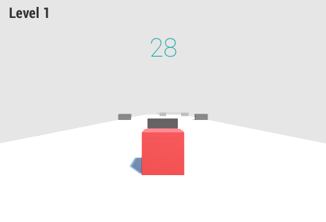

# Runner Ball

Runner Ball is an engaging and dynamic endless runner game developed using Unity. In this game, players control a rolling ball navigating through a series of obstacles and challenges, aiming to achieve the highest possible score.



## Features

- **Endless Gameplay**: Unique, procedurally generated paths.
- **Intuitive Controls**: Smooth and responsive inputs.
- **Challenging Obstacles**: Increasing difficulty keeps it exciting.
- **Power-Ups**: Use abilities to overcome challenges.

## How to Play

1. **Control the Ball**: Use the on-screen controls or keyboard arrows to move the ball left or right.
2. **Avoid Obstacles**: Navigate around barriers and gaps to prevent the ball from crashing.
4. **Utilize Power-Ups**: Activate collected power-ups strategically to maximize their benefits.

## Installation

1. **Clone the Repository**:

   ```bash
   git clone https://github.com/vosidovmsaid2007/Runner-Ball.git
   ```

2. **Open in Unity**:

   - Launch Unity Hub.
   - Click on the "Add" button and select the cloned repository folder.
   - Open the project in Unity Editor.

3. **Play the Game**:

   - In the Unity Editor, press the "Play" button to start the game.

## Contributing

Contributions are welcome! If you have suggestions for new features, improvements, or bug fixes, please open an issue or submit a pull request.

## License

This project is licensed under the MIT License. See the [LICENSE](LICENSE) file for details.

## Acknowledgments

- Developed by Vosidov Muhammadsaid.
- Special thanks to the Unity community for their support and resources.

---

Feel free to share your feedback or ideas to improve the game. Happy gaming!
